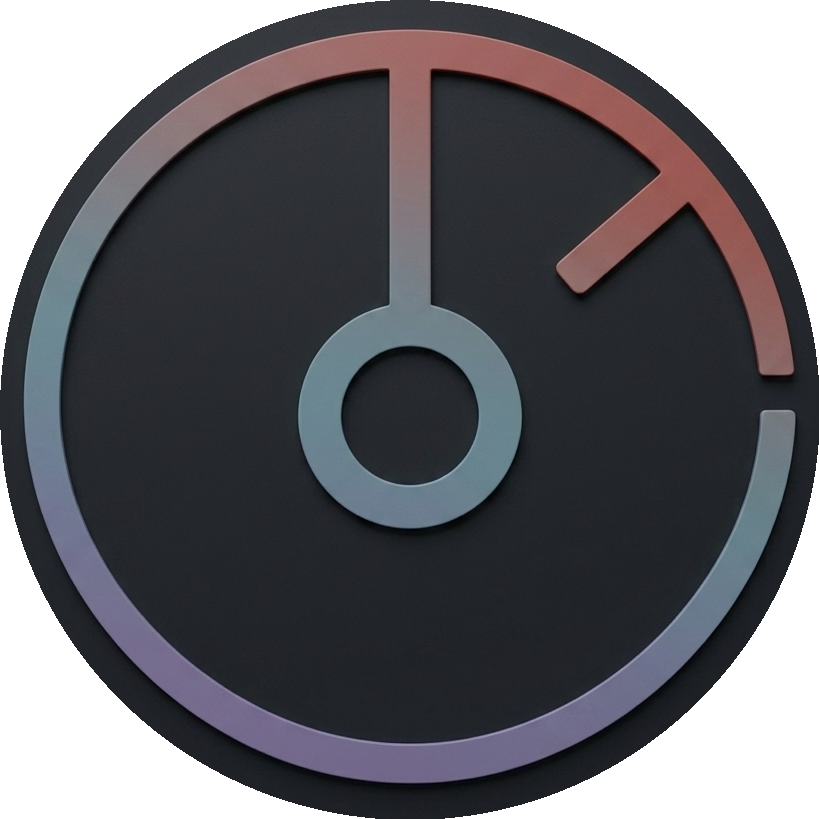
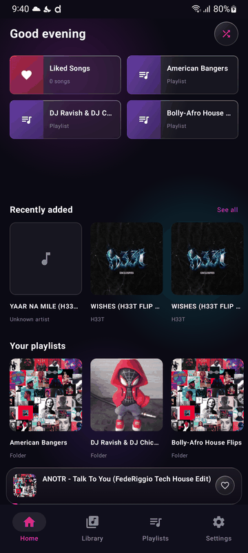
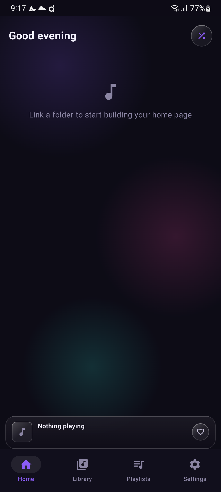
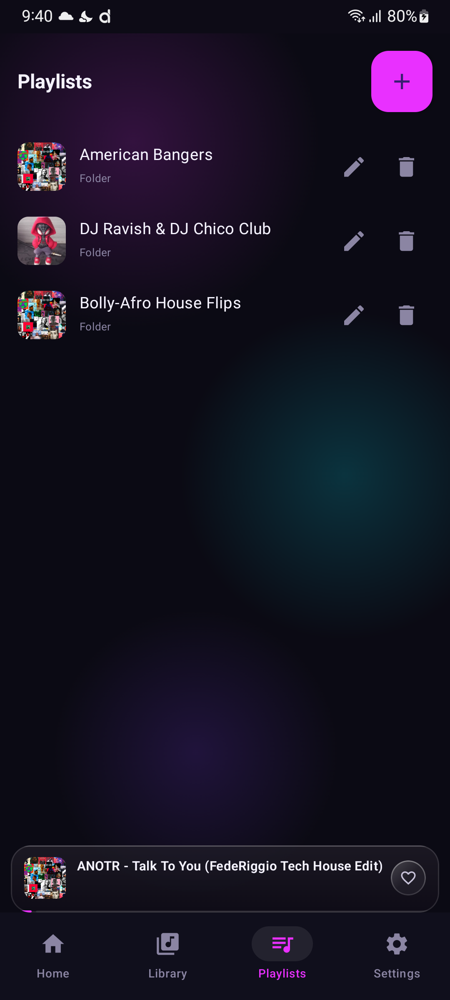
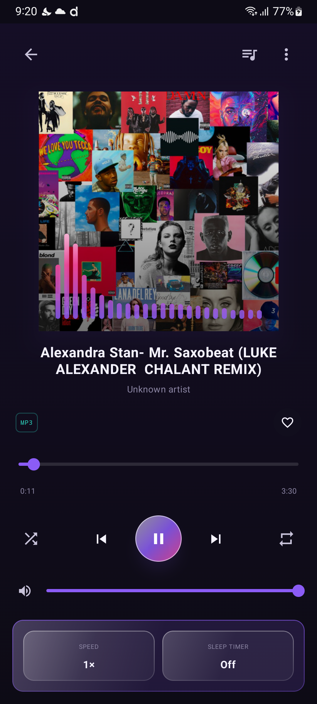
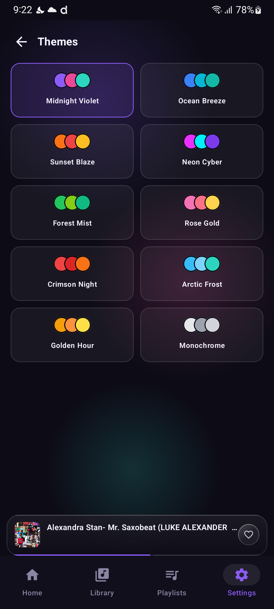
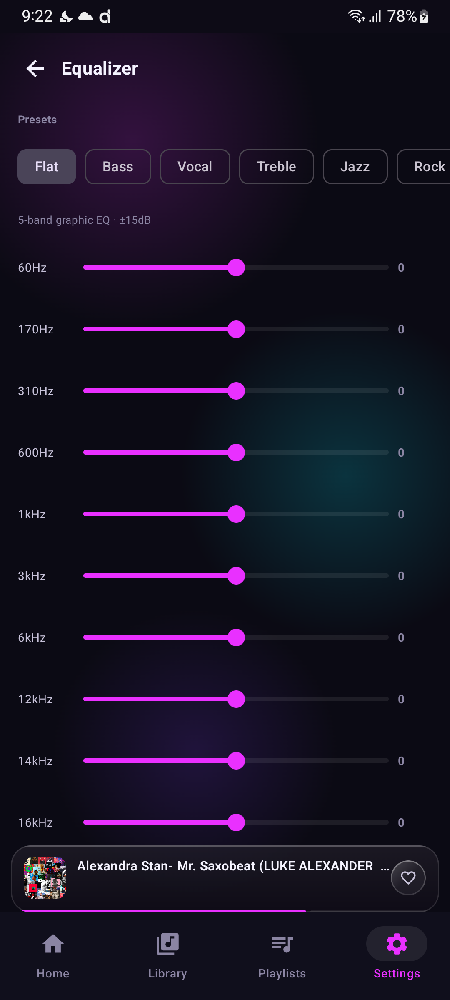
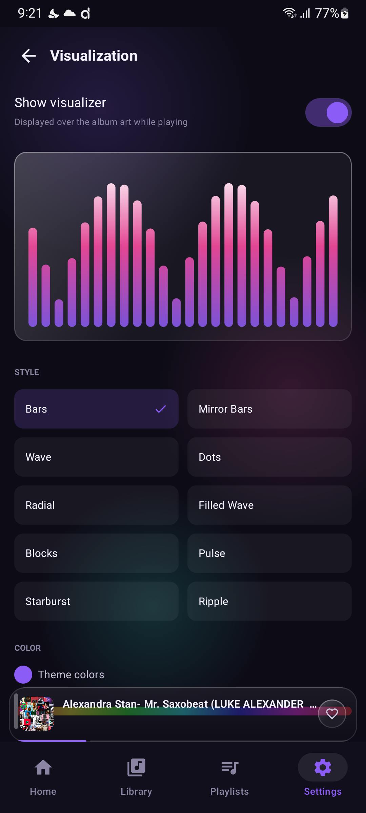

<div align="center">
  
  <h1>GrooveBox for Android</h1>
  <p><strong>Your music. No account. No ads. No internet required.</strong></p>
  <p>
    
    
    
  </p>
</div>

---

GrooveBox is a free, open-source local music player for Android. No sign-in, no ads, no tracking, no internet connection required — just your own music library, played at its best, wrapped in a state-of-the-art frosted-glass UI with a 10-band equalizer, real-time visualizer, and deep customization.



## Features

| Feature | Details |
|---------|---------|
| 🔒 **No account, no ads, no internet** | Plays entirely from your device's local storage — nothing ever leaves your phone |
| 🌫 **Frosted-glass UI** | Translucent panels, animated ambient gradients, and light-catching sheen throughout — the same glass language as the Desktop app, with more room to customize |
| 🎨 **10 built-in themes** | Midnight Violet, Ocean Breeze, Sunset Blaze, Neon Cyber, Forest Mist, Rose Gold, Crimson Night, Arctic Frost, Golden Hour, Monochrome — every accent and background re-tints live |
| 🎛 **10-band Equalizer** | Manual band control plus Flat/Bass/Vocal/Treble/Jazz/Rock presets, ±15dB range |
| 🌊 **Live Visualizer** | Real-time frequency-reactive visualizer, with its own customization screen |
| 📋 **Playlists & Liked songs** | Unlimited playlists, custom cover art, likes-based ranking |
| 📁 **Linked folders** | Point it at any folder via Storage Access Framework — library builds itself |
| 🎧 **Bluetooth-aware playback** | Auto-resumes when a Bluetooth device reconnects; same for wired headphones |
| 🔔 **Full media session** | Lock-screen controls, notification controls, volume-key pause/resume |

## Screenshots

| | |
|---|---|
|  |  |
|  |  |
|  |  |

## Download

👉 **[Download the latest APK](https://github.com/akshit1503/groovebox-android/releases/latest)**

Android will warn about installing from outside the Play Store the first time — that's expected for a sideloaded APK; tap **Install anyway**.

## Building from source

Requires [Android Studio](https://developer.android.com/studio) (or just the command line with a configured Android SDK).

```bash
git clone https://github.com/akshit1503/groovebox-android.git
cd groovebox-android

# Debug build
./gradlew assembleDebug

# Release build (unsigned)
./gradlew assembleRelease
```

Output APKs land in `app/build/outputs/apk/`.

## Tech stack

- **Kotlin + Jetpack Compose** for the entire UI
- **Media3 / ExoPlayer** for playback, with a `MediaSessionService` for lock-screen and notification controls
- **Room** for the local library, playlist, and likes database
- **DataStore** for lightweight settings persistence

## Permissions

| Permission | Why |
|------------|-----|
| `FOREGROUND_SERVICE` / `FOREGROUND_SERVICE_MEDIA_PLAYBACK` | Keeps playback running with a persistent notification |
| `POST_NOTIFICATIONS` | Shows the playback notification (Android 13+) |
| `RECORD_AUDIO` | Required by the Android `Visualizer` API even though it only reads the current playback session's output buffer — GrooveBox never accesses the microphone |
| `BLUETOOTH_CONNECT` | Only requested if you enable "Resume on Bluetooth connect" in Settings |
| `REQUEST_IGNORE_BATTERY_OPTIMIZATIONS` | Optional — lets you exempt GrooveBox from aggressive OEM battery killing so background playback isn't interrupted |

No `INTERNET` permission is requested — GrooveBox has no network code at all.

## License

MIT © 2025 Akshit Singh · [akshitsingh153@gmail.com](mailto:akshitsingh153@gmail.com)
